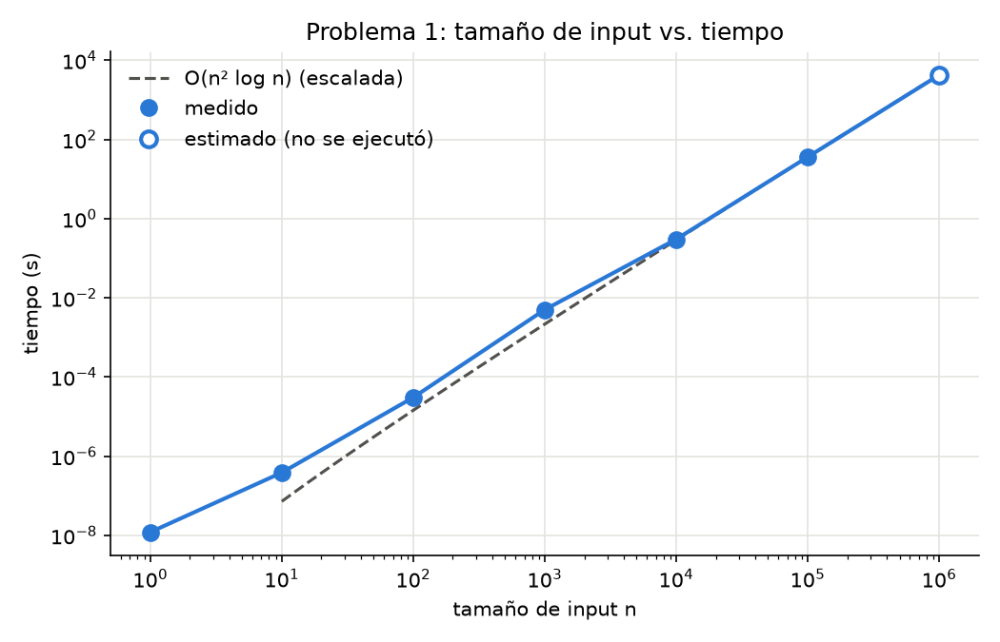
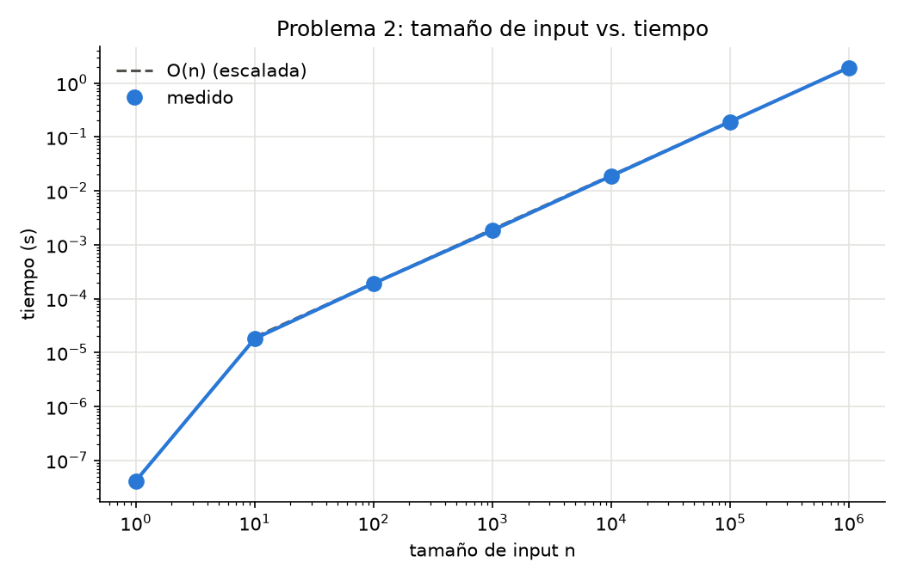
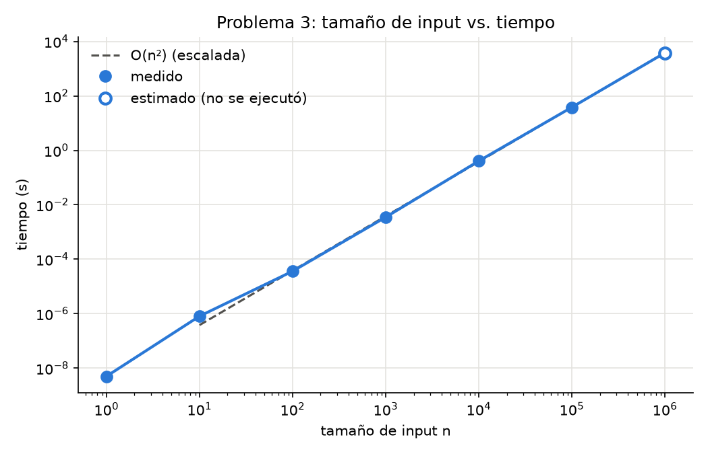

# Laboratorio 8 - Teoría de la Computación

Análisis de complejidad y profiling de tres programas, más ejercicios teóricos.

**Video:** https://youtu.be/BG4WzJeQTDA

## Estructura

```
problema1/problema1.c     Problema 1 en C
problema2/problema2.py    Problema 2 en Python
problema3/problema3.c     Problema 3 en C
graficas/graficar.py      Genera las gráficas (.png) y resultados/tablas.md
resultados/               CSV con los tiempos de cada problema
respuestas/               PDF con las partes teóricas (1a, 2a, 3a, 4 y 5) y su fuente en LaTeX
correr_todo.bat           Compila y corre todo en orden
```

## Requisitos

- **gcc** (yo usé gcc 16.1 de MSYS2 en Windows 11)
- **Python 3** (probado con 3.14) y **matplotlib**:
  ```
  python -m pip install matplotlib
  ```

## Cómo correrlo

Todo se corre **desde la carpeta raíz del repo** (los programas escriben en `resultados/`).

Todo de una vez (~4 minutos):
```
correr_todo.bat
```

O cada problema por separado:
```
gcc -O0 -o problema1\problema1.exe problema1\problema1.c
problema1\problema1.exe

python problema2\problema2.py

gcc -O0 -o problema3\problema3.exe problema3\problema3.c
problema3\problema3.exe

python graficas\graficar.py
```

Para ver el profiling por función del problema 2 con cProfile:
```
python -m cProfile -s tottime problema2\problema2.py
```

## Decisiones que tomé

- **C para los problemas 1 y 3, Python para el 2.** El 1 y el 3 son cuadráticos o peores y en
  Python tardarían ~100 veces más. El 2 es lineal y corre bien en Python.
- **n que no terminan.** Con n = 1 000 000 el problema 1 hace ~5·10¹² iteraciones y el problema 3
  ~8·10¹⁰ printf (cientos de GB de texto). Ninguno se puede correr en un tiempo razonable, así que
  arriba de un límite de operaciones (`LIMITE_OPS`) el programa **no lo ejecuta y estima** el tiempo
  con el tiempo por operación de la última corrida. En las tablas y gráficas aparecen como "estimado".
- **`-O0` al compilar.** Con `-O2` gcc puede borrar los ciclos (el contador no se usa para nada)
  y el tiempo sale 0. Además `function` devuelve el contador y se suma a una variable global.
- **`long long` para el contador** del problema 1, porque pasa de 2³¹ (llega a ~4·10¹⁰).
- **La salida de "Sequence" va a NUL / devnull.** Si se imprime en la consola se mide qué tan rápida
  es la terminal, no el algoritmo. En el problema 3 además se le pone buffer a stdout con `setvbuf`,
  porque Windows trata `NUL` como consola y sin buffer cada printf tardaba ~4 µs (80 veces más lento).
- **Repeticiones para n chicos.** Con n = 1 o 10 la función tarda menos que la resolución del reloj,
  así que se repite muchas veces y se divide. En el problema 2 además se mide 3 veces y se toma el mínimo.
- **Gráficas en escala log-log**, si no todos los puntos menos el último quedan pegados al cero.
  La línea punteada es la función teórica escalada para que pase por el último punto medido.

## Resultados

### Problema 1 - O(n² log n)

| n | iteraciones | tiempo | tipo |
|---:|---:|---:|---|
| 1 | 2 | 9.0 ns | medido |
| 10 | 120 | 288.0 ns | medido |
| 100 | 17,850 | 26.79 µs | medido |
| 1,000 | 2,505,000 | 1.67 ms | medido |
| 10,000 | 350,070,000 | 248.00 ms | medido |
| 100,000 | 42,500,850,000 | 99.58 s | medido |
| 1,000,000 | 5,000,010,000,000 | 11715 s (~3.3 h) | estimado |



### Problema 2 - O(n)

| n | prints | tiempo | tipo |
|---:|---:|---:|---|
| 1 | 0 | 51.0 ns | medido |
| 10 | 10 | 23.14 µs | medido |
| 100 | 100 | 216.78 µs | medido |
| 1,000 | 1,000 | 2.16 ms | medido |
| 10,000 | 10,000 | 23.20 ms | medido |
| 100,000 | 100,000 | 238.44 ms | medido |
| 1,000,000 | 1,000,000 | 2.45 s | medido |



### Problema 3 - O(n²)

| n | prints | tiempo | tipo |
|---:|---:|---:|---|
| 1 | 0 | 3.0 ns | medido |
| 10 | 9 | 648.0 ns | medido |
| 100 | 825 | 47.03 µs | medido |
| 1,000 | 83,250 | 4.83 ms | medido |
| 10,000 | 8,332,500 | 438.00 ms | medido |
| 100,000 | 833,325,000 | 126.79 s | medido |
| 1,000,000 | 83,333,250,000 | 12679 s (~3.5 h) | estimado |



### Observaciones

- Los tres siguen la forma que da el análisis: en log-log las pendientes son ~1 (problema 2)
  y ~2 (problemas 1 y 3).
- En los problemas 1 y 3, el caso n = 100 000 tardó ~3 veces más de lo que predice la curva desde n = 10 000.
  Pasa solo en las corridas que duran más de un minuto, así que creo que es la computadora
  (el CPU baja de frecuencia o Windows mueve el proceso a otro núcleo) y no el algoritmo.
  Las estimaciones de n = 1 000 000 usan el tiempo de n = 100 000, que es el más realista para corridas largas.
- Los tiempos cambian de una computadora a otra; lo que importa es cómo crecen.
